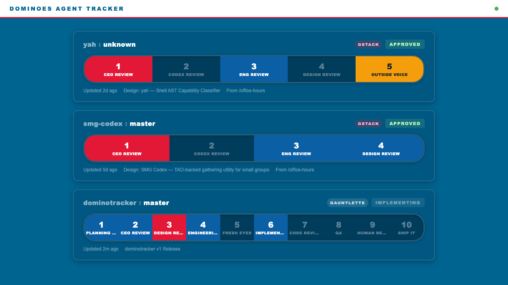

# dominotracker

Domino's Pizza Tracker for your [gauntlette](https://github.com/robertkarl/gauntlette) / [gstack](https://github.com/robertkarl/rkstack) pipeline.



Watch your AI agent pipelines advance through review stages in real time.

## Prerequisites

- Node.js 18+
- [gauntlette](https://github.com/robertkarl/gauntlette) or [gstack/rkstack](https://github.com/robertkarl/rkstack) (https://github.com/garrytan/gstack) installed and actively running pipelines

## Install & run

```bash
git clone https://github.com/robertkarl/DominoesAgentTracker
cd /DominoesAgentTracker
node server.js
```

Opens `http://localhost:3000` automatically. Override port with `PORT=3001 node server.js`.

## Tracking work

Use gstack, gstack-sanitized (https://github.com/robertkarl/rkstack) or gauntlette (https://github.com/robertkarl/gauntlette) to implement a feature or create a project.

You'll see the stages proceed in your DOMINOES AGENT TRACKER local website. Wow!

## How it works

The server reads plan files from `~/.gauntlette/` and `~/.gstack/` . An SSE (`/events`) stream pushes updates to the browser whenever any plan file changes on disk. Each plan's Gauntlette Review Report table becomes a row of stage tiles.

## Agents
No AI agents were harmed during the creation of Dominoes Agent Tracker.
